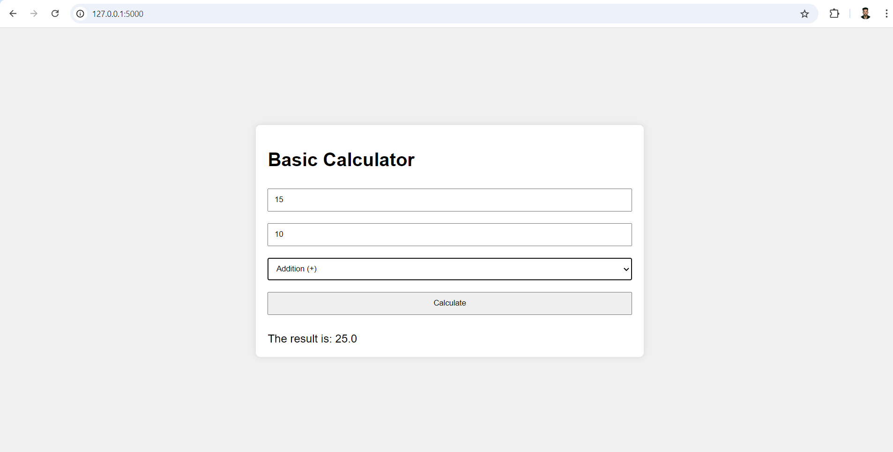

# CODTECH_Task1

# Basic Calculator Web Application

This repository contains a simple web-based calculator application built using Flask, a popular Python web framework. The application allows users to perform basic arithmetic operations such as addition, subtraction, multiplication, and division.

## Features

- **Addition**: Compute the sum of two numbers.
- **Subtraction**: Compute the difference between two numbers.
- **Multiplication**: Compute the product of two numbers.
- **Division**: Compute the quotient of two numbers (with error handling for division by zero).

## Prerequisites

Before running the application, ensure you have the following installed:

- **Python** (version 3.6 or later)
- **Flask** (version 2.0 or later)
